## ETL AI Agents — System Architecture


## Architecture Diagram



### Overview

This system is a modular, AI-driven ETL pipeline. A user or a scheduled job submits an ETL task describing a source, an optional schema or transformation goal, and a destination. An AI Orchestrator plans how to execute that task and delegates work to three specialised agents: Extract, Transform, and Load. Each agent is independently responsible for one stage of the pipeline.

---

### How a pipeline run works

A pipeline job starts in one of two ways. A user sends an HTTP request to the FastAPI server with a job definition, or the built-in scheduler fires a job at a configured interval. Both paths produce a pipeline job record that the Orchestrator picks up.

The Orchestrator reads the job and uses an LLM call to decide which extractor to use, what transformations to apply, and which destination to write to. It does not hard-code these decisions. The AI reads the job definition and produces a pipeline plan. This plan is stored in the job store and passed downstream.

The Extract Agent receives the plan and routes to the right extractor module based on the source type. REST APIs, CSV and Excel files, SQL and NoSQL databases, scraped web pages, and PDFs each have their own extractor. The raw data collected is passed as a normalised intermediate payload to the next agent.

The Transform Agent sends that raw payload to an LLM with instructions to clean, normalise, rename, cast, and map fields. The AI figures out what the data means and reshapes it to match the target schema. For structured sources with clean data, the transformation may be minimal. For PDFs or scraped pages, it may be heavy.

The Load Agent receives the transformed payload and writes it to the destination specified in the original job. The MVP destinations are PostgreSQL, MongoDB, and a flat JSON output. Future destinations like ClickHouse and Cassandra are implemented as additional loader modules without changing anything upstream.

---

### Components

**FastAPI server** handles inbound HTTP requests. It validates job definitions, persists them to the job store, and returns a job ID. All business logic lives in the agents, not in the API layer.

**Scheduler** is a lightweight cron runner (APScheduler) that sits inside the FastAPI process. Scheduled jobs are stored in the database so they survive restarts. On each tick, the scheduler enqueues a pipeline job exactly as if a user submitted it via HTTP.

**AI Orchestrator** is the brain of the system. It takes a raw job definition and produces a structured pipeline plan using an LLM. The plan specifies which extractor to use, what transformation instructions to pass to the Transform Agent, and which loader to invoke. This is where the "AI picks the right extractor" logic lives.

**Extract Agent** contains one extractor class per source type. The Orchestrator selects which one to call. All extractors return the same intermediate data format so the rest of the pipeline does not need to care about the source.

**Transform Agent** sends data to an LLM with a system prompt that describes the target schema and transformation goals. The LLM returns a structured JSON payload. This agent also handles validation and retries if the LLM output does not conform to the expected shape.

**Load Agent** contains one loader class per destination type. It reads the destination config from the pipeline plan and calls the appropriate loader. Loaders handle connection management, batching, and error handling.

**Job store** is a PostgreSQL database that tracks every pipeline run, its status, its plan, and its logs. Redis is used as a fast cache for in-progress job state and for rate limiting LLM calls.

---

### Project structure (planned)

```
etl_agents/
  api/          FastAPI routes and request schemas
  agents/
    orchestrator.py
    extract/    one file per source type
    transform/  LLM transform logic
    load/       one file per destination type
  scheduler/    APScheduler setup and job registration
  store/        DB models and Redis helpers
  config.py
  main.py
```

---

### Design decisions

Agents are plain Python classes, not separate microservices. For an MVP this keeps deployment simple. Each agent can be extracted into its own service later by swapping direct function calls for a queue.

The intermediate data format between agents is a typed Python dataclass. This acts as a contract between stages and makes it easy to add a new extractor or loader without touching other agents.

LLM calls are the only expensive operations. The Transform Agent is the heaviest caller. Rate limiting and retries are handled in a shared LLM client wrapper so individual agents do not need to implement that logic themselves.

Destinations are plug-in style. Adding ClickHouse or Cassandra means writing a new loader class and registering it. Nothing else changes.
